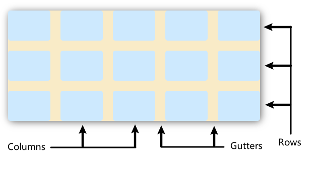

车亮召

## 第二次课

> css3

### 0. 盒子模型


0.1 块级盒子(block box)

- 换行

- width height

- padding margin border

  0.2 内联盒子(inline box)

- 不换行

- 无 width height

  0.3 背景和边框

[官方文档](https://developer.mozilla.org/zh-CN/docs/Learn/CSS/Building_blocks/Backgrounds_and_borders)

```css
.box {
  background: no-repeat center/80% url("../img/image.png");
}
```

### 1. 定位

### 2. 布局

#### 2.1 flex 布局

[官方教程](https://developer.mozilla.org/zh-CN/docs/Learn/CSS/CSS_layout/Flexbox)

[example](./practice02/flex/index.html)


```css
section {
  display: flex;
  flex-direction: row; /* or column */
  flex-wrap: wrap; /* 换行 */
  /* felx-flow: row wrap; <=> flex-direction: row; flew-wrap: wrap;  */
}

article {
  flex: 1 200px; /* 1是动态尺寸, 200px是弹性盒子内子代元素的宽度至少为200px; */
}

article:nth-of-type(3)  /* 第3个占2格 */ {
  flex: 2 200px;
}
```

#### 2.2 grid 网格布局

[官方教程](https://developer.mozilla.org/zh-CN/docs/Learn/CSS/CSS_layout/Grids)

[example](./practice02//grid/index.html)



```css
.container {
  display: grid;
  /* grid-template-columns: 200px 200px 200px; /* 加3个宽度为200px的列 */
  /* grid-template-columns: 1fr 1fr 2fr; /* fr单位，灵活网格 */
  grid-template-columns: repeat(3, 1fr) /* 重复构建行列 */
  grid-gap: 20px; /* 网格间隙, grid-column-gap 列间隙；grid-row-gap 行间隙；grid-gap 同时设定 */
  gap: 20px; /* 新标准为了通用gap代替grid-gap，两个都写上，保证健壮性 */
}
```

## 第三次课

> 移动端适配

适配方案

1. 媒体查询

> css 的`@media`为不同的媒体查询设置不同的 css

2. Grid 高级布局

> 自动多列填充

3. 响应式图片

> 不同分辨率指定不同的图片

4. rem 方案

> `rem`是相对于 html 根节点字体大小的尺寸单位

## 第四次课 - TypeScript

#### script 模板

html 中的定义 script 模板

```html
<script type="text/template" id="tpl">
  <li><a href="{{site}}"} class="link">{{name}}</a></li>
</script>
```

可以直接使用 Dom 操作操纵该模板，就跟操作普通 html 页面一样

#### localStorage

> localStorage 是 html5 网络存储对象，将数据存储在本地客户端，如果不删除将永久存储；

> 只能存储字符串

```js
let xiaoming = { name: "xiaomin", age: 30 };
localStorage.setItem("person", JSON.stringify(person));

let person = JSON.parse(localStorage.getItem("person"));
```

## 第五次课 - Vue basic

> Options VS. Compositon
>
> Class 写法不管

Options 选项式 API

```js
export default {
  data() {
    return {};
  },
  methods: {},
  computed: {},
  mounted() {},
};
```

为什么叫选项式，因为`data`，`methods`，`mounted`等等都是可选的，需要就添加，不需要可以不写。

Component 组合式 API

```js
import { reactive } from "vue";

export default {
  setup() {
    const state = reactive({ count: 0 });

    function increment() {
      state.count++;
    }

    // don't forget to expose the function as well.
    return {
      state,
      increment,
    };
  },
};
```

**或者** `<script setup>`，这个是重点，

```vue
<script setup>
import { reactive } from "vue";

const state = reactive({ count: 0 });

function increment() {
  state.count++;
}
</script>

<template>
  <button @click="increment">
    {{ state.count }}
  </button>
</template>
```

### Component API

#### `reactive()` & `ref()` 区别

[官方解释](https://vuejs.org/guide/essentials/reactivity-fundamentals.html#limitations-of-reactive)

`reactive()`的两点限制：

1. 只适用于对象类型(object, array, collections types)；原始类型（string, number, boolean）无法使用

2. 引用丢失

```js
let state = reactive({ count: 0 });
// the above reference ({ count: 0 }) is no longer being tracked (reactivity connection is lost!)
state = reactive({ count: 1 });
```

这也会导致，解构赋值或者函数传递属性，会导致丢失响应式连接(reactivity connection)。

## 第六次课 - Browser


storage

- localStorage
- sessionStorage
- Cookies

vue 配置 api 代理

> 在`vue.configjs`文件中
>
> 解决开发时的跨域访问问题

```js
const { defineConfig } = require("@vue/cli-service");
module.exports = defineConfig({
  transpileDependencies: true,
  devServer: {
    proxy: {
      "/api/": {
        target: "http://localhost:3280",
        changeOrigin: true,
      },
    },
  },
});
```

原理
vue 中的 proxy 就是利用了 Node 代理，通过 Node 服务器端代理转发，因为服务器端不存在跨域的问题。

## 第六次作业

html 中的 click 和 onclick 区别

onclik 是 html 中的 v-on:click(@click) 是 vue 定义的
